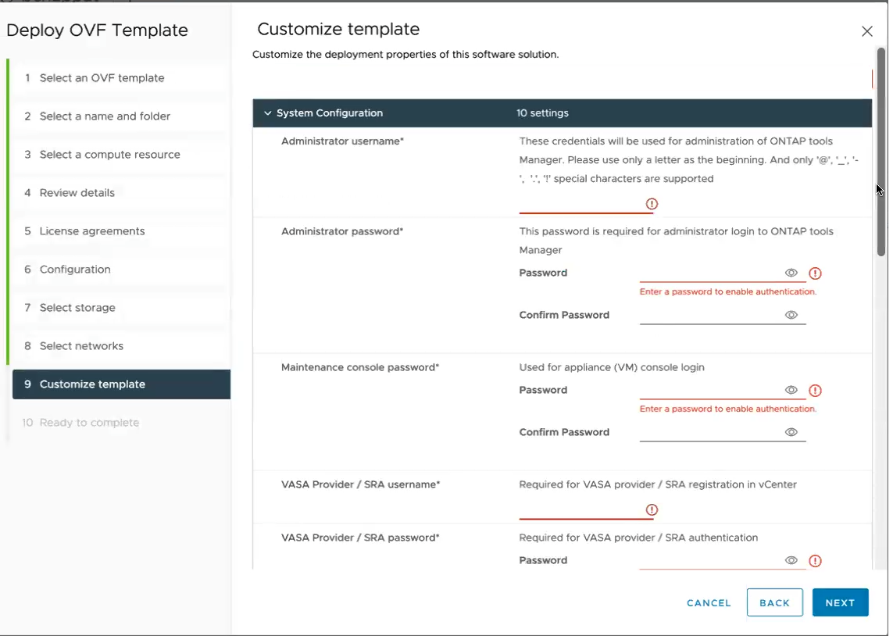

= Deploy HA configuration
:icons: font
:imagesdir: ../media/

[.lead]

You can configure HA three nodes in either small, medium, or large configurations. HA deployment uses Trident to store the services data.

* Small HA three nodes contain 8 CPUs and 16 GB RAM per node.
* Medium HA three nodes contain 12 CPUs and 24 GB RAM per node.
* Large HA three nodes contain 16 CPUs and 32 GB RAM per node.

*Before you begin*

This task gives you instructions on how to install HA three nodes in small, medium, or high configurations.
[NOTE]
Creating the content library is a mandatory step for deploying HA three nodes configuration. Refer to link:../deploy/download-ontap-tools.html[Create content library] section for the procedure. For more information, refer to https://blogs.vmware.com/vsphere/2020/01/creating-and-using-content-library.html[Creating and Using Content Library] blog.

Make sure you have imported your OVA into your content library. Keep the name of the content library and the library item name that you have given to your OVA item handy.

[NOTE]
Before proceeding with the deployment, set the cluster's Distributed Resource Scheduler (DRS) on the inventory to 'Conservative' during the installation of ONTAP tools. This ensures that VM's do not migrate during the installation.

*Steps*

. Log in to the vSphere server.
. Navigate to the resource pool that you have created or to the cluster or the host where you want to deploy the OVA.
. Right-click the required location and select *Deploy OVF template...*.
[NOTE]
Do not deploy ONTAP tools for VMware vSphere virtual machine on a vVols datastore that it manages.
. Select the OVA file either through the URL for the _.ova_ file or browse to the folder where the _.ova_ file is saved, and then click *Next*.
. To deploy ONTAP tools for VMware vSphere from content library:
.. Go to your content library and click on the library item that you want to deploy. 
.. Click on *Actions* > *New VM from this template*
. Select a computer resource and click *Next*.
. Review the details of the template and click *Next*.
. Read and accept the license agreement and click *Next*.
. Select the deployment configuration and click *Next*.
. Select the storage for the configuration and the disk files and click *Next*.
. Select the destination network for each source network and click *Next*.
. Select *Customize template* > *System configuration* window. 
+

Enter the following details:

.. Administrator username and password
.. Maintenance console password
.. VASA provider/SRA user name and password
.. ONTAP tools IP address
.. Node Interconnect IP address
.. NTP server
.. Enable AutoSupport
.. AutoSupport proxy URL
. Select *Customize template* > *External storage configuration* window.
+
Enter the following details

.. Select the Protocol type.
.. Enter the ONTAP cluster management IP address in the *ONTAP management LIF* field.
.. Enter the ONTAP cluster data LIF in the *ONTAP data LIF* field. The data LIF should belong to the protocol selected. For example, if iSCSI protocol selected, then an iSCSI data LIF should be provided.
.. For Storage VM, you can choose to provide your ONTAP’s default storage VM details or create a new storage VM. Do not enter the value in *Storage VM* field when Enable SVM scoping is selected as this field is ignored.
.. Enter ONTAP user name and password.
.. Select *Enable SVM scoping* option if you intend to use the directly added SVM user account. To use ONTAP cluster, do not select the checkbox.
+
[NOTE]
When SVM scope is enabled you should have already enabled SVM support with management IP address.  
. In *Customize template* > *Content Library Details* window, enter the *Content library name* and the *OVF template name*.
. In *Customize template* > *vCenter Configuration* window, provide the details of the vCenter Server where the content library is hosted.
. In *Customize template* > *Node Configuration* window, enter the following details: 
+
[NOTE]
The information provided here is validated for proper patterns during installation process. In case of discrepancy, an error message is displayed on the web console, and you are prompted to correct any incorrect information provided.
+
.. Enter the Host name. Host names that consist of uppercase letters (A-Z), lowercase letters (a-z), digits (0-9), and the hyphen (-) special character only are supported. If you want to configure dual stack, specify the host name mapped to IPv6 address.
.. Specify the primary DNS server IP address.
.. Specify the secondary DNS server IP address.
.. Specify the search Domain name to use when resolving the hostname.
.. Enter IP address (IPv4) mapped to the host name. In case of dual stack, provide any available IPv4 IP address that is in the same VLAN as the IPv6 address.
.. Specify the subnet mask to use on the deployed network in Netmask (only for IPV4) field. 
.. Specify the IPv4 gateway address on the deployed network.
.. Enter the IPV6 address on the deployed network only when you need dual stalk.
.. Specify the prefix length only if IPv6 address is selected. 
.. Specify the IPv6 gateway address on the deployed network.
. In *Customize template* > *Node 2 Configuration* and *Node 3 Configuration* windows, enter the following details:
.. Host name 2 and 3 - Host names that consist of uppercase letters (A-Z), lowercase letters (a-z), digits (0-9), and the hyphen (-) special character only are supported. If you want to configure dual stack, specify the host name mapped to IPv6 address.
.. IP address
.. IPV6 address
. Review the details in the *Ready to complete* window, select *Finish*.
+
As the deployment task gets created, the progress is shown in the vSphere task bar.
. Power on the VM after the completion of the task.
+
The installation begins. You can track the installation progress in VM’s web console.
As part of the installation, node configurations are validated. The inputs provided under different sections under the Customize template in the OVF form are validated. In the case of any discrepancies, a dialog prompts you to take corrective action.
. Make necessary changes in the dialog prompt. Use tab button to navigate across the panel and select *OK*.
+
On selecting *OK*, the values provided is validated again. ONTAP tools for VMware vSphere allows you three attempts to correct any invalid values. If you are unable  to correct issues after three attempts, the product installation stops and you are advised to try the installation on a fresh VM. 

After successful installation, the web console shows the state of ONTAP tools for VMware vSphere.