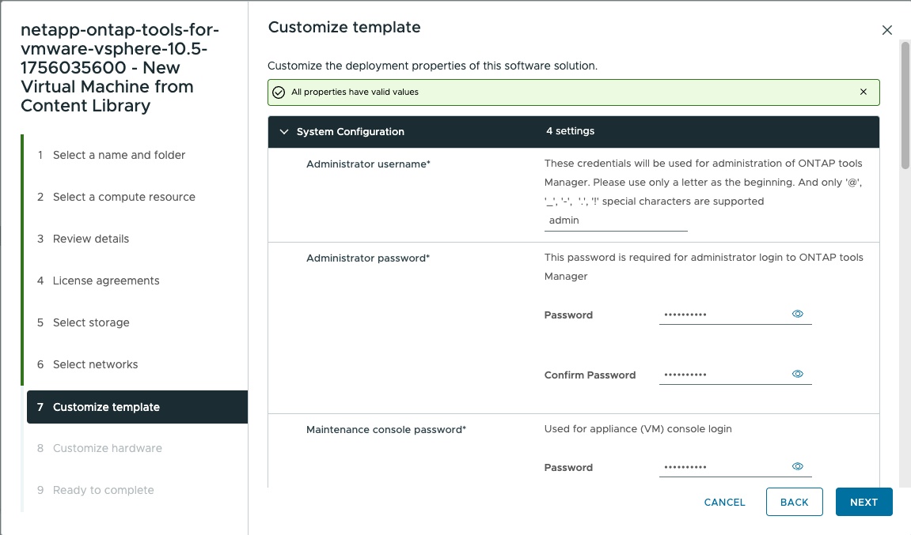

= Deploy ONTAP tools
:icons: font
:imagesdir: ../media/

[.lead]
Deploy ONTAP tools for VMware vSphere as an extra-small single-node appliance that supports NFS and VMFS datastores. The deployment process takes up to 45 minutes.

.Before you begin

If you deploy an extra-small single-node configuration, a content library is optional. For multi-node or HA deployments, a content library is required.

In VMware, a content library stores VM templates, vApp templates, and other files. Using a content library simplifies deployment because it is not dependent on direct network access during template operations.

Before you create a content library:

* Create the content library on a shared datastore so all hosts in the cluster can access it.
* Create the content library before deploying the ONTAP tools for VMware vSphere OVA.
* Keep the OVA template in the content library after deployment.

[NOTE]
If you plan to enable HA later, deploy the ONTAP tools VM in an ESXi cluster or resource pool, not directly on an ESXi host.

To create a content library:

. Download the ONTAP tools for VMware vSphere binaries (_.ova_) and signed certificates from the https://mysupport.netapp.com/site/products/all/details/otv10/downloads-tab[NetApp Support Site^].
. Log in to the vSphere Client.
. From the vSphere Client menu, select *Content libraries*.
. Select *Create*.
. Enter a name, and create the content library.
. Open the content library you created.
. Select *Actions* > *Import item*, and import the OVA file.

[NOTE]
For more information, see https://blogs.vmware.com/vsphere/2020/01/creating-and-using-content-library.html[Creating and Using Content Library].

[NOTE]
Before deployment, set the cluster Distributed Resource Scheduler (DRS) to Conservative to prevent VM migration during installation.

ONTAP tools for VMware vSphere is initially deployed as a non-HA configuration. To scale to HA later, enable CPU hot add and memory hot plug during deployment or by editing VM settings after deployment.
// updated for OTVDOC-255 - Jani

.Steps

. Download the ONTAP tools OVA file and signed certificates from the https://mysupport.netapp.com/site/products/all/details/otv10/downloads-tab[NetApp Support Site^]. If you have already imported the OVA into your content library, skip this step.
. Log in to the vSphere server.
. Go to the resource pool, cluster, or host where you want to deploy the OVA.
+
[IMPORTANT]
Do not store the ONTAP tools VM on vVols datastores that it manages.
. Deploy the OVA from either the content library or the local system.
+
|===
|From the local system|From the content library
|
a. Right-click and select *Deploy OVF template...*.

b. Choose the OVA file from the URL or browse to its location, then select *Next*.
|
a. Go to your content library and select the library item that you want to deploy. 

b. Select *Actions* > *New VM from this template*
|===
. In *Select a name and folder*, enter the VM name and location.
+
For vCenter Server 8.0.3, select *Customize this virtual machine's hardware* to enable an additional hardware configuration step.
image:../media/select-name.png[Select a name and folder]
. Select a computer resource and select *Next*. Optionally, check the box to *Automatically power on deployed VM*.
. Review the details of the template and select *Next*.
. Read and accept the license agreement and select *Next*.
. Select the storage for the configuration and the disk format and select *Next*.
. Select the destination network for each source network and select *Next*.
. In the *Customize template* window, enter the required values.
// 
image:../media/custom-temp-p2.png[Customize template]
[NOTE]
The vCenter hostname is the name of the vCenter Server instance where the ONTAP tools appliance is deployed.
+
If you are deploying ONTAP tools in a two-vCenter Server topology, where the appliance is hosted in one vCenter instance and manages another, assign a restricted role for the vCenter instance that hosts ONTAP tools.
Create a dedicated vCenter user and role with only the permissions required for OVF template deployment. For details, see link:../concepts/rbac-vcenter-use.html#vsphere-object-hierarchy[Roles included with ONTAP tools for VMware vSphere 10].
+
For the vCenter instance managed by ONTAP tools, ensure that the vCenter user account has administrator privileges.
+
[NOTE] 
* Host names must include letters (A-Z, a-z), digits (0-9), and hyphens (-). For dual stack, specify the host name mapped to the IPv6 address.
[NOTE]
Pure IPv6 is not supported. Mixed mode is supported with a VLAN that contains both IPv6 and IPv4 addresses.
* ONTAP tools IP address (formerly load balancer) is the external endpoint for ONTAP tools Manager (`\https://<ip>:8443/virtualization/ui/`), API calls, and plug-in access from the vCenter UI.
* ONTAP tools virtual IP address (formerly node interconnect) is assigned to the Kubernetes API (kube-api) server and acts as the virtual IP for the Kubernetes control plane.
* IPv4 address is the node management address mapped to the specified host name, and is used for diagnostic shell and SSH access.
// updated for https://jira.ngage.netapp.com/browse/OTVDOC-367
// update for OTVDOC-262 
. For vCenter Server 8.0.3, in the *Customize hardware* window, enable *CPU hot add* and *Memory hot plug* to support HA functionality.
image:../media/customize-hw105-p2-1.png[CPU hot add]
image:../media/customize-hw105-p2.png[Memory hot plug]
// OTV10.5 P2 update
// Applicable only to vCenter 8.0.3
. Review the details in the *Ready to complete* window, select *Finish*.
+
When the deployment task starts, progress is shown in the vSphere task bar.
// we might need to add another step to To customize the hardware. go to vSphere client menu >  in the inventory go to your VM > edit settings. 
. If you did not select automatic power on, power on the VM after the task completes.

Track installation progress from the VM web console.

If there are discrepancies in the OVF form, a dialog box prompts corrective action. Use the tab key to navigate, make the required changes, and select *OK*. You have three attempts to resolve issues. If problems continue after three attempts, the installation stops, and you should retry the installation on a new virtual machine.

.What’s next?

If you have deployed ONTAP tools for VMware vSphere with vCenter Server 7.0.3, then follow these steps after the deployment.

. Log in to the vCenter client.
. Power down the ONTAP tools VM.
. Right-click the VM and select *Edit settings*.
. Under *CPU*, check *Enable CPU hot add*.
. Under *Memory*, check *Enable* for *Memory hot plug*.
//OTVDOC-334 updated by Jani