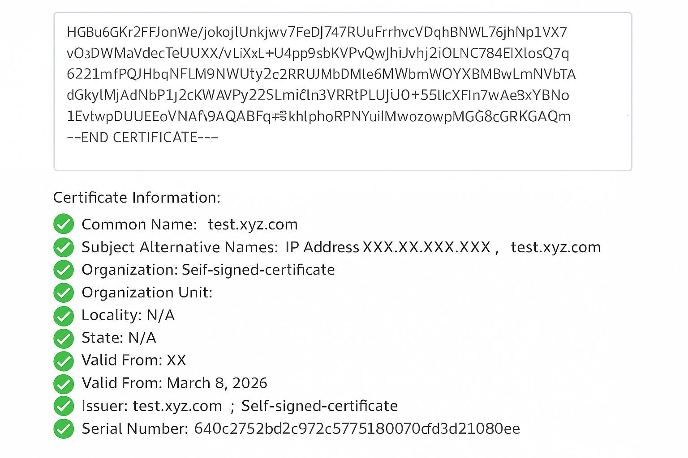

= Change certificate validation flag in ONTAP tools
:icons: font
:imagesdir: ../media/

[.lead]
By default, the certificate validation flag is enabled (set to true). You can set the ONTAP storage backend certificate validation flag to false if you need to bypass SAN certificate checks. This setting is not applicable to vCenter Server certificates.

.Before you begin

You need to have maintenance user login credentials.

.Steps

. From the vCenter Server, open a console to ONTAP tools.
. Log in as the maintenance user.
. Enter `1` to select *Application Configuration* menu.
. Enter `3` to change cert validation flag.
+
The maintenance console shows the certificate validation flag status and prompts you to change it.
. Enter 'y' to toggle the flag or 'n' to cancel.

When you enable the certificate validation flag (set to true), ONTAP tools checks that all storage backends use certificates with a Subject Alternative Name (SAN). If any backend uses a certificate without a SAN, you cannot enable certificate validation. Before enabling this flag, verify that all storage backends use SAN-based certificates. If you disable the certificate validation flag (set to false), ONTAP tools bypasses certificate validation for all configured storage backends.

// NADIAA checked
== Verify SAN-based certificates for storage backends

To ensure secure communication and proper validation, verify that all storage backends use SAN-based certificates:

. Check that the ONTAP management certificate includes a Subject Alternative Name (SAN) entry.
. Confirm that the SAN entries match the ONTAP management IP address or DNS name, or both.
. Ensure the details used to onboard ONTAP match the IP address or DNS name in the SAN entry of the certificate.

Following these steps helps prevent certificate validation issues and ensures that the ONTAP system is securely integrated.

The following sample certificate shows the decoded information:

// github issue https://github.com/NetAppDocs/ontap-tools-vmware-vsphere-10/issues/139