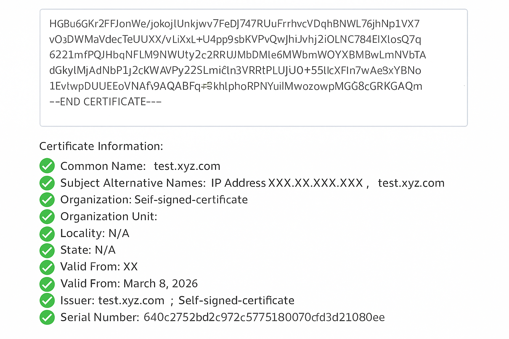

= Change certificate validation flag in ONTAP tools
:icons: font
:imagesdir: ../media/

[.lead]
By default, certificate validation is enabled for ONTAP storage backend certificates. If needed, you can set the certificate validation flag to false to bypass SAN certificate checks. This setting does not apply to vCenter Server certificates.

.Before you begin

You need the maintenance user credentials.

.Steps

. Log in to the vCenter Server.
. Locate the ONTAP tools VM and launch the web console.
. Log in using the `maint` credentials.
. Enter `1` to select *Application Configuration* menu.
. Enter `3` to change the certificate validation flag.
+
The maintenance console shows the certificate validation flag status and prompts you to change it.
. Enter 'y' to toggle the flag or 'n' to cancel.

When certificate validation is enabled, ONTAP tools checks that all storage backends use certificates with a Subject Alternative Name (SAN). If any storage backend uses a certificate without a SAN, you cannot enable validation. Before you enable this flag, verify that all storage backends use SAN-based certificates. If you disable the flag, ONTAP tools bypasses certificate validation for all configured storage backends.

// NADIAA checked
== Verify SAN-based certificates for storage backends

To ensure secure communication and proper validation, verify that all storage backends use SAN-based certificates:

. Check that the ONTAP management certificate includes a Subject Alternative Name (SAN) entry.
. Confirm that the SAN entries match the ONTAP management IP address or DNS name, or both.
. Ensure the details used to onboard ONTAP match the IP address or DNS name in the SAN entry of the certificate.

These steps help prevent certificate validation issues and keep the ONTAP system securely integrated.

The following sample certificate shows the decoded information:

// github issue https://github.com/NetAppDocs/ontap-tools-vmware-vsphere-10/issues/139