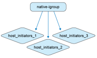
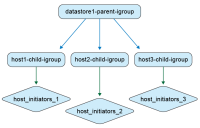
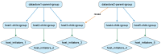
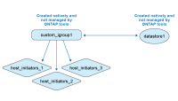
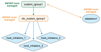

= Nested igroup management in ONTAP tools
:icons: font
:imagesdir: ../media/

[.lead]
If you move datastores from environments not managed by ONTAP tools to environments that are, understand how igroups behave. ONTAP tools for VMware vSphere uses a nested igroup model, which helps explain behavior differences between earlier releases and the current implementation.

Beginning with ONTAP tools for VMware vSphere 10.4, ONTAP tools automatically creates and maintains ONTAP and vCenter objects, which simplifies datastore management in VMware datacenter environments. Beginning with ONTAP tools for VMware vSphere 10.5 P2, ONTAP tools also deletes migrated igroups automatically when they are no longer in use.

== Quick behavior summary

* ONTAP tools-managed VMFS datastores use nested igroups: one parent igroup per datastore context and child igroups per host.
* LUN mappings are applied to child igroups.
* Custom parent igroups can be reused across datastores.
* Migrated igroups from ONTAP tools 9.x cannot be reused.

== Igroup contexts

ONTAP tools for VMware vSphere handles igroups in two contexts.

// new topic for 10.5
.Non-ONTAP tools managed igroups

As a storage administrator, you can create igroups on the ONTAP system as flat or nested structures. The following illustration shows a flat igroup created directly in ONTAP.

.ONTAP tools managed igroups

When you create datastores, ONTAP tools for VMware vSphere creates igroups in a nested structure.

For example, if you create datastore1 and mount it on hosts 1, 2, and 3, then create datastore2 and mount it on hosts 3, 4, and 5, ONTAP tools reuses the host-level igroup for efficient management.

== Naming behavior

When you create a datastore and leave the igroup field blank, ONTAP tools creates a default nested igroup structure.

* Parent igroup naming pattern: `otv_<vcguid>_<host_parent_datacenterMoref>_<datastore_name>`
* Child igroup naming pattern: `otv_<hostMoref>_<vcguid>`

The ONTAP systems interface shows the relationship between parent and child igroups in the *Parent Initiator Group* field.

== Behavior by scenario

[cols="25,25,25,25",options="header"]
|===
|Scenario
|Parent igroup behavior
|Child igroup behavior
|LUN mapping and visibility

|Datastore created with default igroup setting
|A default ONTAP tools-managed parent igroup is created.
|Host-level child igroups are created as needed.
|LUNs are mapped to child igroups. The datastore appears in vCenter Server inventory.

|Datastore created with custom igroup name
|A custom parent igroup is created with the specified name.
|Existing host-level child igroups are reused when hosts overlap.
|The new datastore LUN is mapped to the reused or newly created child igroup. The datastore appears in vCenter Server.

|Existing custom igroup reused during datastore creation
|An existing custom parent igroup is selected and reused.
|Child igroups are reused or extended based on host membership.
|The new datastore LUN is mapped through the associated child igroup. The datastore appears in vCenter Server.

|Datastore and igroup created natively in ONTAP and vCenter, then discovered by ONTAP tools
|ONTAP tools creates a parent igroup in its management context and keeps the original igroup name.
|ONTAP tools renames the original igroup with the `otv_` prefix and represents it as a child igroup in the hierarchy.
|Initiator mappings remain unchanged. Only igroups mapped to datastores are converted during discovery.
|===

== Custom igroup reuse and API behavior

In the ONTAP tools user interface, you can reuse an existing custom parent igroup from the drop-down list while creating a datastore.

The same behavior is supported through the API. To reuse an existing igroup during datastore creation, provide the igroup UUID in the API request payload.

[NOTE]
Only custom igroups can be reused. Migrated igroups from ONTAP tools 9.x cannot be reused and, beginning with ONTAP tools 10.5 P2, are deleted automatically when no longer in use.
// OTV10.5 P2 updates

== Native-to-managed conversion view

If you create the igroup and datastore directly in ONTAP systems and VMware environments, ONTAP tools does not manage these objects initially, resulting in a flat igroup structure.

After datastore discovery, ONTAP tools identifies and registers datastore-mapped igroups, then represents them in a nested model. The parent igroup is represented at the datastore level, the existing igroup is renamed with the `otv_` prefix as a child igroup, and initiator mappings remain unchanged.

ONTAP tools for VMware vSphere does not detect or manage igroups that are created in ONTAP systems but are not mapped to a datastore or linked to ONTAP tools. During discovery, ONTAP tools converts only those igroups that are mapped to discovered datastores; other igroups remain unmanaged.

== Reuse of discovered native igroups

After ONTAP tools manages a discovered native igroup, that igroup is available in the custom initiator group name drop-down list for datastore creation.

The new datastore LUN is mapped to the normalized child igroup, for example, `otv_NativeIgroup1`.

ONTAP tools for VMware vSphere does not detect or use igroups created in ONTAP systems that are not managed by ONTAP tools or not linked to a datastore.
